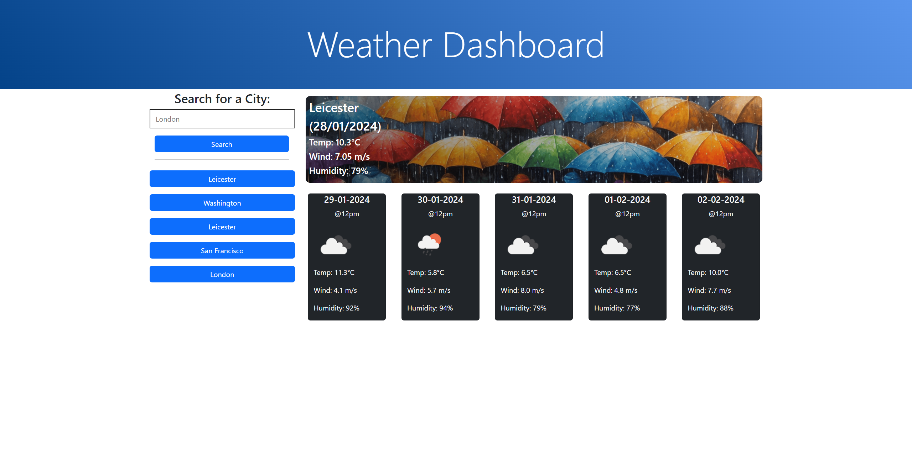
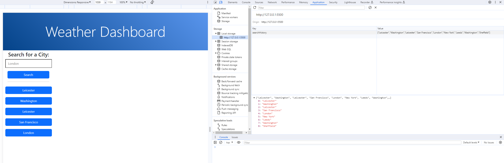

# Weather-Dashboard

Week 8 Challenge - Server APIs

## Description

In this weeks challenge, we have been tasked with creating a weather dashboard using the OpenWeather API in order to display the current weather for any city that is searched by the user, along with a 5 day weather forecast and a search history that is saved and retrieved from local storage. Dayjs is also used to parse dates.

## Installation

Visit https://sarenne89.github.io/Weather-Dashboard in your browser.

## Usage

## Credits

edX Bootcamp instructors
OpenWeather
DayJS

## License

MIT License

---

© 2024 edX Boot Camps LLC. Confidential and Proprietary. All Rights Reserved.

## Features

A series of questions and answers giving a high score at the end of the quiz.

## Tests

Code can be inspected via the Google Chrome 'Inspect' option and selecting the console when opening the HTML file.
